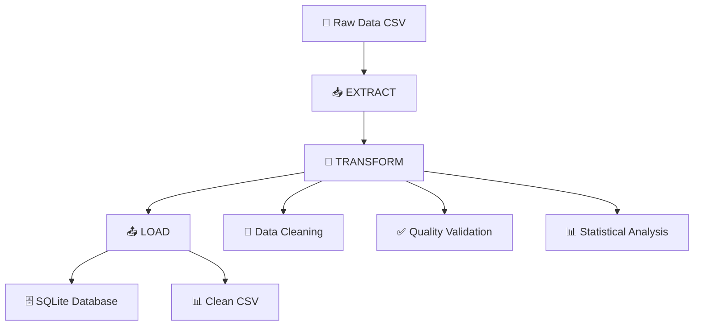

# 🎵 SpotifyBigData - Pipeline ETL Avanzado

> **Pipeline ETL modular y robusto para el procesamiento inteligente de datos musicales de Spotify**

[](https://python.org)
[](https://pandas.pydata.org)
[]()
[]()

## 📋 Índice

- [🎯 Descripción del Proyecto](#-descripción-del-proyecto)
- [🏗️ Arquitectura del Sistema](#️-arquitectura-del-sistema)
- [📁 Estructura Detallada](#-estructura-detallada)
- [🧹 Sistema de Limpieza de Datos](#-sistema-de-limpieza-de-datos)
- [🔧 Módulos y Funcionalidades](#-módulos-y-funcionalidades)
- [📊 Dataset de Spotify 2023](#-dataset-de-spotify-2023)
- [🚀 Guía de Uso](#-guía-de-uso)
- [📈 Ejemplos de Uso](#-ejemplos-de-uso)
- [🛠️ Configuración](#️-configuración)
- [🔍 Validación y Calidad](#-validación-y-calidad)
- [📚 Referencias](#-referencias)

---

## 🎯 Descripción del Proyecto

**SpotifyBigData** es un pipeline ETL (Extract, Transform, Load) de nivel empresarial diseñado específicamente para procesar y analizar datos musicales de Spotify. El proyecto implementa técnicas avanzadas de limpieza de datos, validación de calidad y transformaciones inteligentes para convertir datos crudos en información analítica de alta calidad.

### 🎨 Características Principales

- **🔄 Pipeline ETL Modular**: Arquitectura separada y escalable
- **🧹 Limpieza Inteligente**: Algoritmos avanzados de detección y corrección
- **📊 Validación de Calidad**: Sistema completo de QA para Big Data
- **🎵 Especializado en Música**: Optimizado para datos de plataformas musicales
- **📈 Reportes Detallados**: Análisis completo del proceso de transformación
- **🔧 Altamente Configurable**: Parámetros personalizables para diferentes escenarios

---

## 🏗️ Arquitectura del Sistema

El sistema sigue el patrón **ETL (Extract, Transform, Load)** con una arquitectura modular inspirada en mejores prácticas de ingeniería de datos:



### 🔧 Principios de Diseño

1. **Separación de Responsabilidades**: Cada módulo tiene una función específica
2. **Reutilización**: Componentes modulares y extensibles
3. **Trazabilidad**: Logging detallado de cada transformación
4. **Escalabilidad**: Optimizado para datasets grandes
5. **Calidad**: Validación en cada etapa del proceso

---

## 📁 Estructura Detallada

```
SpotifyBigData/
├── 📂 app/                           # Núcleo de la aplicación ETL
│   ├── 📂 Config/                    # 🔧 Configuración centralizada
│   │   ├── __init__.py               # Inicializador del módulo
│   │   └── SMEConfig.py              # Configuraciones globales y rutas
│   │
│   ├── 📂 Extract/                   # 📥 Módulo de extracción de datos
│   │   ├── __init__.py               # Inicializador del módulo
│   │   ├── SMExtract.py              # Extractor principal de datos CSV
│   │   └── 📂 Files/                 # 📁 Repositorio de datos
│   │       ├── spotify-2023.csv      # Dataset original de Spotify
│   │       └── etl_data.db           # Base de datos SQLite generada
│   │
│   ├── 📂 Transform/                 # 🔄 Motor de transformación de datos
│   │   ├── __init__.py               # Inicializador del módulo
│   │   └── SMETransform.py           # Sistema avanzado de limpieza
│   │
│   └── 📂 Load/                      # 📤 Módulo de carga de datos
│       ├── __init__.py               # Inicializador del módulo
│       └── SMEloader.py              # Cargador multi-formato
│
├── 📂 data/                          # 📊 Datos procesados y outputs
├── 📄 main.py                        # 🎯 Orquestador principal del pipeline
├── 📄 requirements.txt               # 📦 Dependencias del proyecto
├── 📄 README.md                      # 📚 Documentación completa
└── 📄 .gitignore                     # 🚫 Exclusiones de Git
```

### 📂 Descripción de Carpetas

#### 🔧 **Config/** - Centro de Configuración
**Propósito**: Centralizar todas las configuraciones del sistema
- **SMEConfig.py**: Define rutas dinámicas, parámetros de base de datos, configuraciones de limpieza
- **Valor**: Facilita mantenimiento y permite cambios sin modificar código

#### 📥 **Extract/** - Motor de Extracción
**Propósito**: Responsable de la lectura y validación inicial de datos
- **SMExtract.py**: Extractor robusto con validación de archivos y manejo de errores
- **Files/**: Repositorio seguro de datos originales y procesados
- **Valor**: Garantiza integridad desde el origen y prepara datos para transformación

#### 🔄 **Transform/** - Núcleo de Transformación
**Propósito**: El corazón del sistema, donde ocurre la magia de la limpieza
- **SMETransform.py**: Sistema avanzado con 15+ algoritmos de limpieza especializados
- **Valor**: Convierte datos sucios en información confiable y analizable

#### 📤 **Load/** - Sistema de Persistencia
**Propósito**: Almacenamiento inteligente en múltiples formatos
- **SMEloader.py**: Cargador con validación, respaldo y múltiples destinos
- **Valor**: Asegura que los datos limpios estén disponibles para análisis

---

## 🧹 Sistema de Limpieza de Datos

### 🎯 ¿Por Qué es Crucial la Limpieza de Datos?

En el mundo del análisis de datos musicales, la **calidad de los datos determina la calidad de los insights**. Nuestro sistema de limpieza aborda:

- **🎵 Streams inconsistentes**: Valores no numéricos en columnas de reproducciones
- **📅 Fechas malformadas**: Años, meses, días con formatos incorrectos
- **📊 Porcentajes corruptos**: Características musicales con valores inválidos
- **🔢 Campos mixtos**: Columnas que mezclan texto y números
- **❌ Valores faltantes**: Datos incompletos que comprometen el análisis

### 🛠️ Metodología de Limpieza Avanzada

#### 1. **📊 Análisis Exploratorio Inicial**
```python
# Ejemplo de análisis automático
cleaner = DataClean(df)
analysis = cleaner.analyze_null_values()
# Reporta: total de nulos, porcentajes, columnas afectadas
```

#### 2. **🎵 Limpieza Especializada por Tipo de Columna**

##### **Columnas Numéricas Específicas de Spotify:**
- `streams` - Número de reproducciones
- `bpm` - Beats por minuto
- `danceability_%`, `valence_%`, `energy_%` - Características musicales
- `in_spotify_playlists`, `in_apple_charts` - Presencia en plataformas

**Proceso de Limpieza:**
1. **Detección Inteligente**: Identifica columnas que deberían ser numéricas
2. **Sanitización**: Remueve caracteres especiales (`,`, `$`, `%`)
3. **Conversión Robusta**: `pd.to_numeric(errors='coerce')`
4. **Imputación Estadística**: Reemplaza valores inválidos con la mediana
5. **Validación Final**: Confirma que solo existan valores numéricos válidos

##### **Columnas de Texto/Categóricas:**
- `track_name`, `artist_name` - Información del artista
- `key`, `mode` - Características musicales categóricas

**Proceso de Limpieza:**
1. **Normalización**: Estandariza espacios y capitalización
2. **Imputación por Moda**: Rellena valores faltantes con el valor más frecuente
3. **Validación de Consistencia**: Verifica formatos esperados

#### 3. **🔍 Detección y Eliminación de Duplicados**
```python
# Algoritmo inteligente de duplicados
dup_info = cleaner.remove_duplicates()
# Retorna: cantidad removida, porcentaje, estrategia aplicada
```

#### 4. **📈 Detección de Valores Atípicos (Outliers)**
```python
# Método IQR (Rango Intercuartílico)
outlier_info = cleaner.remove_unwanted_values(remove_outliers=True)
# Identifica y trata valores estadísticamente atípicos
```

#### 5. **✅ Control de Calidad (QA) para Big Data**
```python
# Sistema completo de QA
qa_report = cleaner.quality_assessment()
# Genera: score de calidad, completitud, unicidad, recomendaciones
```

### 📊 Algoritmos de Imputación

#### **Para Datos Numéricos: Mediana**
**¿Por qué Mediana y no Media?**
- **Robustez ante Outliers**: La mediana no se ve afectada por valores extremos
- **Datos Musicales**: En música, valores como BPM o reproducciones pueden tener outliers naturales
- **Preservación de Distribución**: Mantiene mejor las características estadísticas originales

```python
# Ejemplo: Columna 'streams' con valores atípicos
streams_original = [1000, 1200, 1500, 999999999, 1100]  # 999M es outlier
median_value = 1200  # No afectada por el outlier
mean_value = 200002560  # Distorsionada por el outlier
```

#### **Para Datos Categóricos: Moda**
**¿Por qué Moda?**
- **Preserva Distribución Natural**: Mantiene las frecuencias originales
- **Lógica Musical**: En datos de música, ciertos géneros o claves son más comunes
- **Consistencia Semántica**: No introduce valores artificiales

---

## 🔧 Módulos y Funcionalidades

### 📥 **Extract/SMExtract.py** - Extractor Inteligente

#### **Clase Principal: `SpotifyExtractor`**

**Funcionalidades Avanzadas:**
- **🔍 Validación de Archivos**: Verifica existencia, permisos y formato
- **📊 Metadatos Automáticos**: Extrae información del archivo (tamaño, fecha)
- **🛡️ Manejo de Errores**: Captura y reporta problemas de lectura
- **💾 Optimización de Memoria**: Configuraciones para datasets grandes

**Métodos Principales:**
```python
extractor = SpotifyExtractor('path/to/spotify.csv')

# Extracción básica
data = extractor.extract_data()

# Vista previa sin cargar todo
preview = extractor.get_preview(n_rows=10)

# Información detallada del archivo
info = extractor.get_data_info()

# Extracción + limpieza en un paso
clean_data = extractor.extract_and_clean()
```

### 🔄 **Transform/SMETransform.py** - Motor de Transformación

#### **Clase Principal: `DataClean`**

**Sistema Modular de Limpieza:**

##### **🎵 Métodos Especializados para Spotify:**
- `clean_specific_numeric_columns()`: Procesa las 20 columnas numéricas específicas
- `analyze_streams_column()`: Análisis especializado de la columna 'streams'
- `validate_specific_numeric_columns()`: Validación de columnas musicales

##### **🧹 Métodos Generales de Limpieza:**
- `remove_duplicates()`: Eliminación inteligente de duplicados
- `handle_missing_data()`: Estrategias múltiples para datos faltantes
- `remove_unwanted_values()`: Detección y tratamiento de outliers
- `quality_assessment()`: Evaluación completa de calidad

##### **📊 Métodos de Análisis:**
- `analyze_null_values()`: Análisis detallado de valores faltantes
- `get_cleaning_summary()`: Resumen completo del proceso
- `print_quality_report()`: Reporte legible de calidad

**Flujo de Transformación Completo:**
```python
cleaner = DataClean(raw_data)

# Proceso completo automatizado
results = cleaner.comprehensive_clean(
    remove_duplicates=True,
    handle_missing=True,
    remove_unwanted=True,
    run_qa=True
)

# Validación específica de Spotify
validation = cleaner.validate_specific_numeric_columns()

# Datos finales limpios
clean_data = cleaner.get_cleaned_data()
```

### 📤 **Load/SMEloader.py** - Cargador Multi-formato

#### **Clase Principal: `Loader`**

**Capacidades de Carga:**
- **🗄️ SQLite**: Base de datos local optimizada
- **📄 CSV**: Formato estándar para análisis
- **📋 JSON**: Formato para APIs y aplicaciones web
- **🔄 Multi-formato**: Carga simultánea en varios destinos

**Características Avanzadas:**
- **✅ Validación Pre-carga**: Verifica integridad antes de guardar
- **🔄 Respaldos Automáticos**: Preserva versiones anteriores
- **📊 Métricas de Performance**: Reporta tiempos y tamaños
- **🛡️ Manejo de Errores**: Rollback en caso de fallos

---

## 📊 Dataset de Spotify 2023

### 🎵 Descripción del Dataset

El dataset **"Most Streamed Spotify Songs 2023"** contiene información detallada sobre las canciones más populares en Spotify durante 2023.

### 📋 Estructura de Datos (24 Columnas)

#### **🎤 Información Básica de la Canción**
- `track_name`: Nombre de la canción
- `artist_name`: Nombre del artista
- `artist_count`: Número de artistas colaboradores

#### **📅 Información de Lanzamiento**
- `released_year`: Año de lanzamiento
- `released_month`: Mes de lanzamiento
- `released_day`: Día de lanzamiento

#### **📊 Métricas de Popularidad**
- `streams`: Número total de reproducciones
- `in_spotify_playlists`: Presencia en playlists de Spotify
- `in_spotify_charts`: Posición en charts de Spotify

#### **🎧 Presencia en Otras Plataformas**
- `in_apple_playlists`: Presencia en Apple Music
- `in_apple_charts`: Posición en charts de Apple
- `in_deezer_playlists`: Presencia en Deezer
- `in_deezer_charts`: Posición en charts de Deezer
- `in_shazam_charts`: Presencia en Shazam

#### **🎼 Características Musicales**
- `bpm`: Beats por minuto (tempo)
- `key`: Clave musical (C, C#, D, etc.)
- `mode`: Modo musical (Major/Minor)

#### **🎨 Atributos de Audio (%)**
- `danceability_%`: Qué tan bailable es la canción
- `valence_%`: Positividad musical (feliz/triste)
- `energy_%`: Intensidad y poder de la canción
- `acousticness_%`: Nivel de instrumentos acústicos
- `instrumentalness_%`: Ausencia de vocales
- `liveness_%`: Presencia de audiencia en vivo
- `speechiness_%`: Presencia de palabras habladas

### 🔍 Desafíos de Calidad en el Dataset

1. **🎵 Columna 'streams'**: Valores no numéricos mezclados con números
2. **📅 Fechas inconsistentes**: Formatos variables en fecha de lanzamiento
3. **📊 Porcentajes corruptos**: Características musicales con valores inválidos
4. **🔢 Campos mixtos**: Columnas numéricas con texto
5. **❌ Valores faltantes**: Datos incompletos en varias columnas

**Nuestro sistema ETL aborda cada uno de estos desafíos con algoritmos especializados.**

---

## 🚀 Guía de Uso

### 📦 Instalación y Configuración

#### **1. Clonar el Repositorio**
```bash
git clone https://github.com/Sebastianfandi24/SpotifyBigData.git
cd SpotifyBigData
```

#### **2. Instalar Dependencias**
```bash
pip install -r requirements.txt
```

#### **3. Verificar Estructura**
```bash
python -c "import pandas as pd; print('✅ Pandas instalado correctamente')"
```

### 🎯 Ejecución Básica

#### **Ejecutar Pipeline Completo**
```bash
python3 main.py
```

**Salida Esperada:**
```
Datos nulos en el CSV original:
track_name               0
artist_name              0
streams                 50
bpm                     20
...

=== ANÁLISIS DE VALORES NULOS ===
Total de filas: 953
Total de columnas: 24
Total de valores nulos: 95

🎵 Limpiando columnas numéricas específicas de Spotify...
🎯 Procesando 20 columnas específicas...

✅ streams: 50 valores rellenados con mediana: 141,625,465
✅ bpm: 20 valores rellenados con mediana: 120.00
...

=== RESUMEN DE LIMPIEZA ===
{'original_shape': (953, 24), 'current_shape': (953, 24), 'rows_removed': 0, 'columns_removed': 0}

Datos guardados en la base de datos SQLite
```

---

## 📈 Ejemplos de Uso

### 🔧 **Uso Básico - Pipeline Automático**
```python
from app.Extract.SMExtract import SpotifyExtractor
from app.Transform.SMETransform import DataClean
from app.Load.SMEloader import Loader

# Pipeline automático
def basic_etl():
    # Extract
    extractor = SpotifyExtractor('app/Extract/Files/spotify-2023.csv')
    raw_data = extractor.extract_data()
    
    # Transform
    cleaner = DataClean(raw_data)
    clean_data = cleaner.clean_data()
    
    # Load
    loader = Loader(clean_data)
    loader.to_sqlite()
    
    return clean_data
```

### 🎵 **Análisis Específico de Columnas Musicales**
```python
def analyze_music_features():
    # Cargar y limpiar datos
    extractor = SpotifyExtractor('app/Extract/Files/spotify-2023.csv')
    raw_data = extractor.extract_data()
    
    cleaner = DataClean(raw_data)
    
    # Análisis específico de 'streams'
    streams_analysis = cleaner.analyze_streams_column()
    print(f"Pureza numérica de streams: {streams_analysis['data_quality']['numeric_percentage']:.1f}%")
    
    # Limpiar columnas específicas
    cleaning_summary = cleaner.clean_specific_numeric_columns()
    
    # Validar resultado
    validation = cleaner.validate_specific_numeric_columns()
    print(f"Validación exitosa: {validation['overall_status']}")
    
    return cleaner.get_cleaned_data()
```

### 📊 **Control de Calidad Avanzado**
```python
def quality_assessment():
    extractor = SpotifyExtractor('app/Extract/Files/spotify-2023.csv')
    raw_data = extractor.extract_data()
    
    cleaner = DataClean(raw_data)
    
    # Proceso completo con QA
    results = cleaner.comprehensive_clean(
        remove_duplicates=True,
        handle_missing=True,
        remove_unwanted=True,
        run_qa=True
    )
    
    # Reporte de calidad
    cleaner.print_quality_report()
    
    # Estadísticas específicas
    stats = cleaner.get_numeric_columns_summary()
    
    return results, stats
```

### 🔄 **Carga Multi-formato**
```python
def multi_format_export():
    # Obtener datos limpios
    clean_data = basic_etl()
    
    # Cargador con validación
    loader = Loader(clean_data)
    
    # Validar antes de cargar
    if loader.validate_data(strict=True):
        # Cargar en múltiples formatos
        results = loader.load_all(
            base_path='output/spotify_clean',
            formats=['csv', 'sqlite', 'json']
        )
        
        # Mostrar resumen
        loader.print_load_summary()
        
        return results
    else:
        print("❌ Datos no pasaron validación")
        return None
```

---

## 🛠️ Configuración

### ⚙️ **Config/SMEConfig.py** - Centro de Control

```python
class Config:
    # Rutas de archivos
    INPUT_PATH = 'app/Extract/Files/spotify-2023.csv'
    SQLITE_DB_PATH = 'app/Extract/Files/etl_data.db'
    SQLITE_TABLE = 'spotify_data_clean'
    
    # Configuraciones de limpieza
    CLEANING_PARAMS = {
        'remove_duplicates': True,
        'handle_missing': True,
        'remove_unwanted': True,
        'missing_threshold': 0.5,
        'outlier_method': 'iqr'
    }
    
    # Información del dataset
    DATASET_INFO = {
        'name': 'Spotify Tracks 2023',
        'expected_columns': 24,
        'expected_rows': 953
    }
```

### 🔧 Parámetros Configurables

#### **Limpieza de Datos:**
- `missing_threshold`: Umbral para eliminar columnas (% de nulos)
- `outlier_method`: Método de detección de outliers ('iqr', 'zscore')
- `fill_strategy`: Estrategia de relleno ('median', 'mean', 'mode')

#### **Base de Datos:**
- `if_exists`: Comportamiento al cargar ('replace', 'append', 'fail')
- `index`: Si guardar índice como columna
- `method`: Método de inserción para optimización

#### **Logging:**
- `log_level`: Nivel de detalle ('DEBUG', 'INFO', 'WARNING', 'ERROR')
- `log_file`: Archivo de logs del proceso
- `max_log_size`: Tamaño máximo de archivos de log

---

## 🔍 Validación y Calidad

### 📊 **Métricas de Calidad Implementadas**

#### **1. Score de Completitud**
```python
completeness_score = (total_cells - null_cells) / total_cells * 100
```

#### **2. Score de Unicidad**
```python
uniqueness_ratio = unique_values / total_values
```

#### **3. Score General de Calidad**
```python
quality_score = (
    completeness_score * 0.4 +      # 40% completitud
    purity_score * 0.3 +             # 30% pureza de tipos
    consistency_score * 0.3          # 30% consistencia
)
```

### ✅ **Validaciones Implementadas**

1. **Integridad de Tipos**: Verifica que columnas numéricas solo contengan números
2. **Rangos Válidos**: Valida que valores estén en rangos esperados
3. **Consistencia Temporal**: Verifica fechas lógicas
4. **Completitud**: Asegura ausencia de valores críticos faltantes
5. **Unicidad**: Detecta y maneja duplicados

### 📋 **Reportes de Calidad**

```python
# Ejemplo de reporte automático
{
    'overall_quality_score': 94.5,
    'completeness': {
        'total_nulls': 0,
        'null_percentage': 0.0,
        'completeness_score': 100.0
    },
    'recommendations': [
        'Los datos tienen buena calidad general',
        'Se recomienda monitorear outliers en BPM'
    ]
}
```

---

## 📚 Referencias

### 🔗 **Datasets y Fuentes**
- [Spotify Most Streamed Songs 2023](https://www.kaggle.com/datasets/nelgiriyewithana/top-spotify-songs-2023) - Dataset original
- [Spotify Web API](https://developer.spotify.com/documentation/web-api/) - Documentación oficial
- [Music Information Retrieval](https://musicinformationretrieval.com/) - Conceptos musicales

### 📖 **Metodologías y Mejores Prácticas**
- [ETL Best Practices](https://www.kimballgroup.com/) - Metodología Kimball
- [Data Quality Framework](https://tdwi.org/) - TDWI Data Quality
- [Pandas Data Cleaning](https://pandas.pydata.org/docs/) - Documentación oficial

### 🛠️ **Herramientas y Tecnologías**
- [Pandas](https://pandas.pydata.org/) - Manipulación de datos
- [NumPy](https://numpy.org/) - Computación numérica
- [SQLite](https://www.sqlite.org/) - Base de datos embebida

---

## 🤝 Contribución

### 📋 **Guías de Contribución**
1. Fork el repositorio
2. Crea una rama feature (`git checkout -b feature/nueva-funcionalidad`)
3. Commit tus cambios (`git commit -am 'Agrega nueva funcionalidad'`)
4. Push a la rama (`git push origin feature/nueva-funcionalidad`)
5. Abre un Pull Request

### 🔧 **Estándares de Código**
- **PEP 8**: Estilo de código Python
- **Docstrings**: Documentación completa de funciones
- **Type Hints**: Anotaciones de tipos cuando sea posible
- **Testing**: Pruebas unitarias para nuevas funcionalidades

---

## 📄 Licencia

Este proyecto está bajo la Licencia MIT. Ver el archivo `LICENSE` para más detalles.

---

## 👨‍💻 Autor

**Sebastián Fandiño**
- GitHub: [@Sebastianfandi24](https://github.com/Sebastianfandi24)
- Email: [sebastianfandi24@example.com]

---

## 🔄 Changelog

### v2.0.0 (Septiembre 2025)
- ✅ Sistema avanzado de limpieza de columnas específicas
- ✅ Validación inteligente de datos musicales
- ✅ Control de calidad para Big Data
- ✅ Reportes detallados y métricas de performance
- ✅ Documentación completa y ejemplos

### v1.0.0 (Inicial)
- ✅ Pipeline ETL básico
- ✅ Limpieza general de datos
- ✅ Carga a SQLite
- ✅ Estructura modular

---

<div align="center">

**🎵 Transformando datos musicales en insights de valor 🎵**

[]()
[](https://python.org)
[]()

</div>

## Descripción de cada módulo

- **Config/SMEConfig.py**: Define rutas y parámetros globales para el pipeline.
- **Extract/SMExtract.py**: Lee el archivo CSV y lo carga en un DataFrame usando pandas.
- **Transform/SMETransform.py**: Limpia los datos usando la clase `DataClean`, que analiza valores nulos y los rellena con mediana (numéricos) o moda (categóricos). También genera un resumen de limpieza y calidad de datos.
- **Load/SMEloader.py**: Prepara los datos limpios para su uso o exportación.
- **main.py**: Ejecuta el flujo ETL completo, mostrando análisis de nulos, resumen de limpieza y los primeros 5 registros limpios.

## Proceso de limpieza de datos


## Proceso detallado de limpieza y llenado de datos

La limpieza de datos se realiza en el módulo `Transform/SMETransform.py` mediante la clase `DataClean`. El proceso sigue estos pasos:

1. **Análisis de valores nulos**
  - Se identifican todas las columnas que contienen valores nulos.
  - Se calcula el número y porcentaje de valores nulos por columna.
  - Se genera un reporte con el total de filas, columnas, columnas afectadas y el porcentaje de nulos.

2. **Llenado de valores nulos**
  - **Columnas numéricas:**  Los valores nulos se rellenan usando la mediana de cada columna. Esto ayuda a evitar que valores extremos (outliers) afecten el resultado, ya que la mediana es menos sensible a ellos que la media.
  - **Columnas categóricas (no numéricas):**  Los valores nulos se rellenan usando la moda (el valor más frecuente) de cada columna. Esto asegura que los datos faltantes se completan con el valor más representativo de la columna.

3. **Resumen de limpieza**
  - Se calcula la forma original y final del DataFrame (filas y columnas).
  - Se reporta cuántos valores nulos quedan tras la limpieza (debería ser cero si todas las columnas fueron tratadas).
  - Se calcula un “score de calidad de datos”, que representa el porcentaje de datos no nulos tras la limpieza.

4. **Visualización y validación**
  - El pipeline muestra en consola el análisis de nulos antes de limpiar, el resumen de limpieza y los primeros 5 registros limpios para validar el resultado.

### Ejemplo de código usado para limpiar los datos

```python
# Rellenar valores faltantes con la mediana en columnas numéricas
numeric_columns = df.select_dtypes(include=[np.number]).columns
for col in numeric_columns:
   df[col] = df[col].fillna(df[col].median())

# Rellenar valores faltantes con la moda en columnas no numéricas
non_numeric_columns = df.select_dtypes(exclude=[np.number]).columns
for col in non_numeric_columns:
   most_frequent = df[col].mode()
   if len(most_frequent) > 0:
      df[col] = df[col].fillna(most_frequent[0])
```

## Configuración y dependencias

Instala las dependencias usando:
```sh
pip install -r requirements.txt
```

Principales librerías usadas:
- pandas
- numpy

## Ejecución del pipeline

Ejecuta el pipeline desde la raíz del proyecto:
```sh
python3 main.py
```

## Pruebas

- Verifica que el archivo `app/Extract/Files/spotify-2023.csv` exista y tenga datos.
- Al ejecutar `main.py`, se debe mostrar:
  - Análisis de valores nulos
  - Resumen de limpieza
  - 5 registros limpios
- Si hay errores de importación, revisa que las rutas sean correctas y que las dependencias estén instaladas.

## Recomendaciones

- Mantén actualizado el archivo `requirements.txt` usando `pip freeze > requirements.txt`.
- Usa ramas Feature para nuevas funcionalidades y Release para preparar versiones de producción.
- Documenta cualquier cambio importante en el README.md.

## Autor
- Sebastián Fandiño
